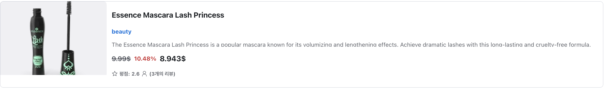
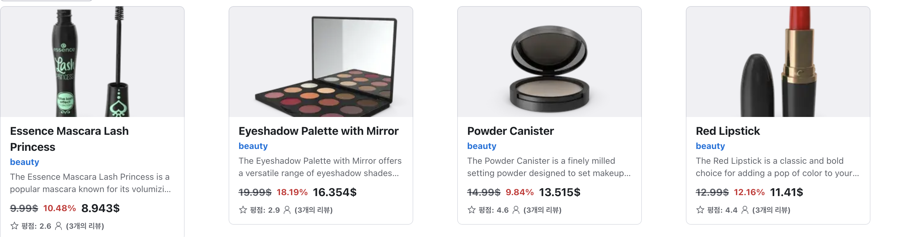

#### 실행 방법

.env파일을 만들고 환경변수 설정을 해주어야 합니다.

```code
//.env
NEXT_PUBLIC_PRODUCT_SERVICE_URL=https://dummyjson.com
NEXT_PUBLIC_CDN_IMAGE_HOST_NAME=cdn.dummyjson.com
```

```code
npm install
npm run dev
```

#### 사용 기술

- Next 14.2.25
- 스타일링 : tailwindcss / radix-ui
- 상태관리 : nuqs
- 폼/유효성관리 : react-hook-form / zod
- 서버 상태 관리 : tanstack-query

#### 페이지 구조 설계

라우트별로 다음과 같은 형태로 구성됩니다.

- models/query-key : useQuery/useSuspenseQuery에서 사용되는 쿼리 키를 관리합니다.
- models/server : 서버 스키마를 관리합니다.
- models.client : zod의 스키마등 서버 스키마가 아닌 것들을 정의합니다.
- hooks : 특정 라우트에서 사용되는 쿼리 파라미터, 쿼리, 뮤테이션을 관리합니다.
- components : 특정 라우트에서 사용되는 컴포넌트들을 정의합니다.

컴포넌트의 분기처리는 `Switcase`컴포넌트를 사용합니다.

useSuspenseQuery 등 suspense와 에러처리를 동시에 하기 위해 `AsyncBoundary`컴포넌트를 사용합니다.

#### radix-ui의 TextField와 react-hook-form사용시 발생한 문제점

react-hook-form에서는 register를 사용하려면 ref를 등록해야 합니다. 하지만 radix-ui의 TextField에는 ref를 주입할 수 없었고, 유효성 검사를 통과해도 오류가 발생했습니다. (invalid-type)

따라서 Controller를 사용하는 방식으로 수정해주었습니다.

Number타입을 제대로 추론하기 위해, 다음과 같이 오직 숫자만 받는 로직을 하나의 유틸로 분리하고,

```ts
export function allowOnlyNumber(value: string) {
  return parseInt(value.replace(/[^0-9]/g, ""));
}
```

Controller를 매번 쓰는 것의 반복을 줄이기 위해 커스텀한 컴포넌트를 만들고, 해당 로직을 사용하게 해주었습니다.

```tsx
export function ControllerWithInput({
  control,
  name,
  leftAddon,
  type,
  label,
  placeholder,
  error,
}: Props) {
  return (
    <Controller
      control={control}
      name={name}
      render={({ field }) => (
        <div>
          <Text size={"2"}>{label}</Text>
          <Input
            size={"3"}
            leftAddon={leftAddon}
            type={type}
            aria-label={name}
            placeholder={placeholder}
            {...field}
            onChange={(e) => {
              if (type === "number") {
                field.onChange(allowOnlyNumber(e.target.value));
              } else {
                field.onChange(e);
              }
            }}
            bottomText={error}
            error={Boolean(error)}
          />
        </div>
      )}
    />
  );
}
```

#### Next Image 관련 오류 해결

Next Image를 쓸 때 어떤 도메인(호스트)의 이미지를 불러올 수 있는지 next.config.js 파일에 명시적으로 설정해주어야 합니다.
따라서 다음과 같이 이미지를 사용할 수 있도록 config에 추가해두었습니다.

```js
/** @type {import('next').NextConfig} */
const nextConfig = {
  images: {
    remotePatterns: [
      {
        protocol: "https",
        hostname: process.env.NEXT_PUBLIC_CDN_IMAGE_HOST_NAME,
        port: "",
        pathname: "/product-images/**",
      },
    ],
  },
};

export default nextConfig;
```

#### View 표시 조건

주어진 요구사항을 고려하기 위해 단순 지역상태를 사용하는 것은 제약이 있다고 느꼈습니다. View표시조건 데이터는 24시간동안 유효해야 하고, 이를 단순 useState훅으로 관리하는 것은 적합하지 않다고 판단했습니다.

다음의 선택지를 고려하였습니다.

- 로컬스토리지를 사용하는 방식
- 쿠키를 사용하는 방식

로컬스토리지를 사용하게 된다면, useLocalStorage훅을 만들고 24시간마다, 커스텀한 이벤트를 발생시키고, 이를 감지해서, View표시를 바꾸는 방식을 생각했습니다.

쿠키를 사용하게 된다면, `쿠키의 지속시간`을 1일로 잡고, 사용자가 직접 쿠키를 건드리지 않는 한, 해당 View표시가 유지되는 방식입니다.

저는 이 두가지의 선택지 중에 쿠키를 선택했습니다. 로컬스토리지로 커스텀한 이벤트를 발생시키고, 감지하는 로직은 직접 타임스탬프를 저장하고 매번 시간을 계산해서 비교해야 하고, 로직이 복잡해지고 실수할 여지가 생긴다고 생각했습니다.
쿠키를 사용하는 것이 더 간결하게 코드를 구성할 수 있다고 생각했고, 쿠키를 선택하게 되었습니다.

#### 상품 카드 컴포넌트에 합성 컴포넌트 적용

카드 컴포넌트는 View표시 조건에 따라 다르게 조합될 여지가 있다고 판단했습니다. 리스트 형 UI의 경우 한 줄을 차지하는 UI가 더 바람직하다고 판단했고, 그리드형의 경우는 어느정도 너비가 고정된 형태가 바람직하다고 느꼈습니다.

- 리스트형의 경우
  

- 그리드형의 경우
  

이를 위해 카드UI를 합성컴포넌트 형식으로 구성하였습니다. 유연하게 카드UI에서 제공된 합성컴포넌트들의 아이템을 사용하여, 사용하는 쪽에서 조립할 수 있게 해주었습니다. 특정 View표시 조건에 얽매이지 않고, 자유도 있게 카드 UI를 구성할 수 있었습니다.

```tsx
<ProductCard key={product.id} {...product} maxWidth={"300px"}>
  <ProductCard.Thumbnail />
  <ProductCard.Title />
  <ProductCard.Category />
  <ProductCard.Description />
  <ProductCard.Price />
  <ProductCard.Rating />
</ProductCard>
```
